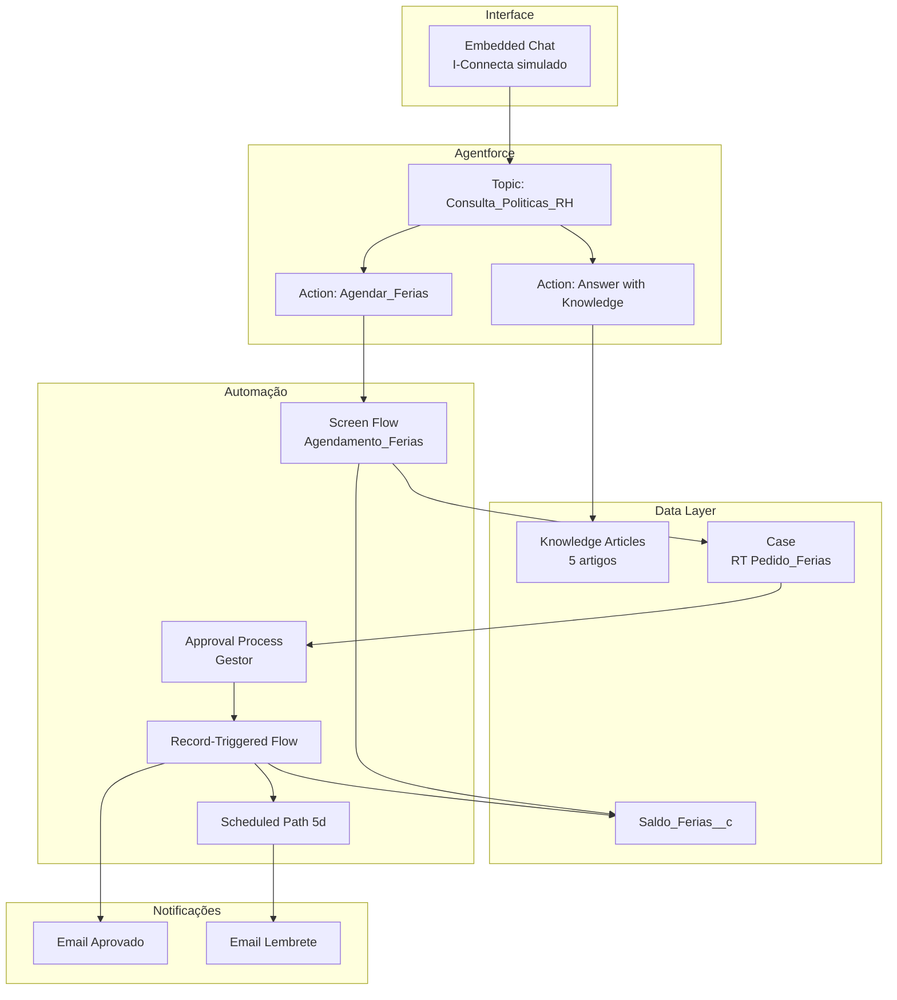

# Arquitetura — Demo Agentforce RH Itaú

## Visão geral

A demo demonstra dois padrões complementares do Agentforce numa única experiência:

1. **Agente informativo (linguagem natural)** — reduz carga do RH respondendo dúvidas recorrentes sobre políticas, usando Knowledge Base como fonte da verdade.
2. **Agente transacional (formulário estruturado)** — garante precisão e determinismo para operações críticas (datas de férias) através de Screen Flow embutido. Essa separação é propositalmente escolhida para contexto bancário, onde ambiguidade em datas é inaceitável.

## Diagrama de componentes

## Decisões de design

### Por que Screen Flow e não NL para agendamento?
Contexto bancário exige determinismo. LLM pode interpretar "segunda que vem" de formas diferentes. Date picker elimina a ambiguidade e permite validação síncrona das regras CLT antes de submeter.

### Por que Case em vez de objeto custom para o pedido?
- Case já tem Approval Process, histórico, SLA, ownership nativo
- Aproveitamento de toda a infra de Service Cloud (fila do RH, macros, quick actions)
- O RH pode usar as mesmas ferramentas que usa para outros pedidos internos

### Por que formula no `Dias_Direito__c`?
A escala do art. 130 CLT depende das faltas injustificadas. Implementar como formula garante que qualquer ajuste de faltas recalcula o direito automaticamente, sem precisar de trigger.

### Por que Roll-Up vs Number manual em `Dias_Tirados__c`?
Para a demo usaremos Number manual atualizado pelo Record-Triggered Flow (mais controlável na apresentação). Em produção, considerar Roll-Up Summary sobre Cases aprovados.

## Breakdown de esforço

| Componente | Horas |
|---|---|
| Setup org + 3 Users + role hierarchy + permission sets | 2 |
| Objeto `Saldo_Ferias__c` (campos, formulas, validation, layout) | 3 |
| Case: RecordType + custom fields + layouts | 2 |
| Approval Process com aprovador dinâmico | 2 |
| 5 Knowledge Articles (escrita + publicação + data categories) | 4 |
| Screen Flow `Agendamento_Ferias_Screen` | 8 |
| Record-Triggered Flow + Scheduled Path 5d | 3 |
| 3 Email Templates Lightning | 1 |
| Agentforce: agent + Topic + scope + instructions | 3 |
| Custom Action invocando Screen Flow | 2 |
| Messaging Channel + EmbeddedServiceConfig | 2 |
| Dados de teste | 1 |
| Testes E2E (3 jornadas) | 3 |
| Roteiro + slides de apoio | 3 |
| **Subtotal** | **39** |
| Margem de risco (tuning Agentforce) +20% | 8 |
| **Total realista** | **~47** |

## Riscos e mitigações

| Risco | Mitigação |
|---|---|
| Classificação do Topic não dispara Action transacional | Testar com 20+ variações de frases ("quero marcar", "preciso agendar", "tirar férias", etc) |
| Scheduled Path não executa em Developer org por limites de tempo | Documentar via tela de admin que a execução é garantida; em demo ao vivo, usar data próxima |
| LLM alucinar políticas fora da KB | Instructions explícitas + fallback `Criar_Caso_Duvida_RH` |
| Aprovador dinâmico falha se colaborador não tem Manager | Validação no Flow antes de submeter + fallback para fila `RH_Ferias` |
